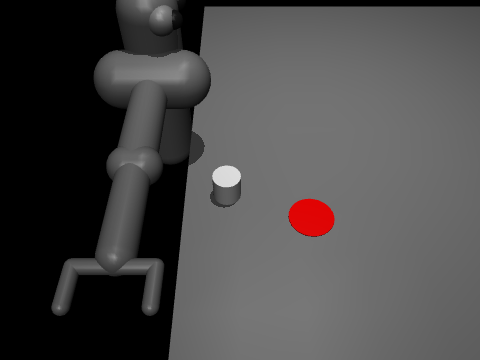

# ferro

A real-time control loop in C++ that drives a simulated robot in MuJoCo with an
ONNX policy, plus a Rust sidecar that collects per-tick telemetry over a
lock-free ring.



A 7-DOF arm pushing a puck 31 cm onto a goal, controlled by `ferro_cascade` at
1 kHz with a 20 Hz policy. The frames are rendered afterward from the state the
Rust sidecar logged during the run.

## Why

Robot control stacks run at two rates. The learned policy runs at 25-100 Hz and
joint control runs at 1-10 kHz. Inference cannot run in the fast loop, since
worst case inference measured 969us against a 1000us budget at 1 kHz.

`ferro_cascade` runs a 1 kHz control thread and a 20-25 Hz policy thread with a
lock-free handoff between them, and `ferro_core` keeps the single-loop version
for comparison. Tasks are a cart-pole and a 7-DOF pusher arm, each with a policy
trained in gymnasium.

## Results

Inference gets slower as the control rate drops, because of the idle gap between
ticks, so a tight loop reports 5.0us for a call that costs 85.4us at 50 Hz.

| period | Mac (ARM) | r11 (x86) |
|---|---|---|
| 50 Hz | 85.4us | 17.4us |
| 1 kHz | 20.8us | 12.4us |
| flat out | 5.0us | 8.6us |

That is 17x on Apple Silicon and 2x on x86, and core migration and frequency
scaling are both plausible causes.

Injecting 5 ms stalls into the policy thread on the Mac, at 1 kHz control and
25 Hz policy, nearly tripled inference latency without moving control timing:

| | no stall | stalls |
|---|---|---|
| inference max | 376us | 969us |
| control tick p99 | 35.4us | 35.5us |
| missed deadlines | 0 | 0 |

Running the same test on r11 and changing only `SCHED_FIFO` against default
priority moved control period min/max from 590/1408us to 997/1006us, so
scheduling accounts for most of the remaining jitter.

Telemetry push costs 0.5us per tick at p50 and 4us at p99.

Python holds 50 Hz but misses 37 of 2000 deadlines at 1 kHz with a worst tick of
8972us, and disabling the GC halves the work tail without changing wake
lateness.

On the pusher, the C++ loop lands the puck a mean of 1.0 cm from the goal over
20 seeds, against 0.6 cm for the same policy in gymnasium, with zero missed
deadlines across 100,000 ticks.

## Tech stack and architecture

- **C++20** for both loops. Deterministic timing and no garbage collector.
- **Rust** for the telemetry consumer, built as a staticlib and linked into the
  C++ binary. The two sides share a byte layout with static assertions on each.
- **MuJoCo** for physics, driven through its C API rather than Python.
- **ONNX Runtime** for inference, so the policy is independent of the framework
  that trained it.
- **CMake** driving both, including the cargo build.

```
+---------------------+   obs_ch (seqlock)   +---------------------+
|  control loop       | -------------------> |  policy thread      |
|  1 kHz, RT priority |                      |  20-25 Hz           |
|  MuJoCo mj_step     | <------------------- |  ONNX Runtime       |
+---------------------+   cmd_ch (seqlock)   +---------------------+
          |
          | tick_ring (SPSC FIFO, drops on full)
          v
+---------------------+
|  Rust sidecar       |
|  telemetry consumer |
+---------------------+
```

Telemetry needs every sample, so it is a queue with counted drops, while the
control loop only reads the newest command, where a queue would deliver stale
values after a stall.

[DESIGN.md](DESIGN.md) covers memory ordering, the layout contract, and
scheduling in more detail.

## Local setup

```
git clone git@github.com:calvinyz/ferro.git && cd ferro
./scripts/fetch_mujoco.sh
./scripts/fetch_onnxruntime.sh
cmake -B build && cmake --build build
./build/cpp_core/ferro_cascade --task pusher --trajectory run.csv
```

Dependencies are version pinned and checksum verified, so there is nothing to
install by hand. Built on macOS/AppleClang/ARM and Linux/GCC 13/x86_64.

`ferro_cascade` takes `--task cartpole|pusher`, `--ticks`, `--control-us`,
`--policy-us`, `--stall-ms`, `--die-after`, `--seed`, and `--trajectory`.
`ferro_core [ticks] [period_us]` and `ferro_eval [episodes] [seed]` run the
cart-pole only. To render a logged run, from `training/`:

```
uv run python render_trajectory.py ../run.csv ../third_party/models/pusher.xml run.gif --camera pusher
```

Tests are `target_channel_test`, `ring_stress_test`, `sidecar_link_test`,
`cargo test` in `rust_sidecar/`, and `training/check_obs_parity.py`, which checks
the C++ tasks against gymnasium.

`SCHED_FIFO` on Linux needs `sudo setcap cap_sys_nice+ep` on the binary, and
rebuilding clears it.

## Next steps

- Run the ring under ThreadSanitizer, since the stress test cannot check
  ordering.
- Swap in a larger policy. The pusher's 75k-parameter MLP still infers in
  under 100us, so the rate split is correct but not yet required.
- Train the pusher on a realistic puck. Pusher-v5's puck weighs 8 mg, so the
  gripper sinks into it in the GIF, and at 78 g the current policy misses by
  32 cm, meaning it learned to exploit the weightless puck.
- Replace the stale-command fallback. Decaying force to zero drops the pole,
  which tests the mechanism but is not a usable policy.
- Move the sidecar into its own process over shared memory. Right now the ring
  lives in the producer's address space.
